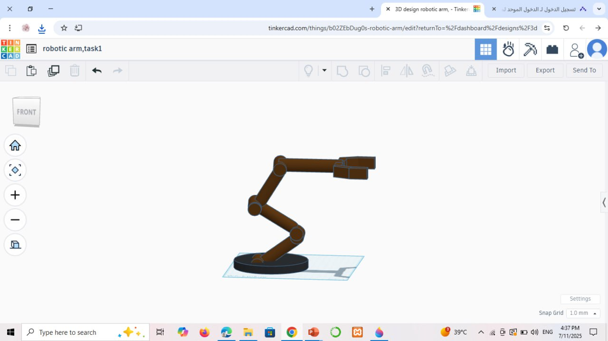

# 🤖 Robotic Arm – Task 1

This project features a 3D robotic arm designed using Tinkercad as part of Task 1 in the Smart Methods internship. The model demonstrates the fundamental structure and articulation points of a robotic arm, with a focus on geometric alignment, rotation axes, and mechanical design principles.

---

## 📂 Files Included

- `robotic arm,task1.stl` — The 3D model file in STL format, ready for 3D visualization or printing.
- Final snapshot image of the robotic arm in Tinkercad view.

---

## 🧩 Design Overview

- Built entirely using **basic geometric shapes** in Tinkercad.
- Consists of a **circular base**, **three main segments (links)**, and a **claw-style end effector (gripper)**.
- Each joint is aligned manually to reflect realistic rotational movement between segments.
- Intended to simulate a **3-DOF (Degrees of Freedom)** robotic arm 

---

## 📸 Final Design Snapshot

---

## 👩‍💻 Created By

🎀  **Ryoof Dukhailallah AlMalki**  🎀
